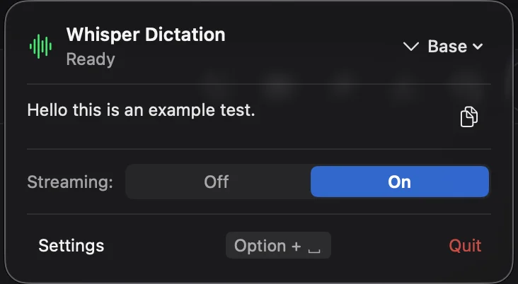
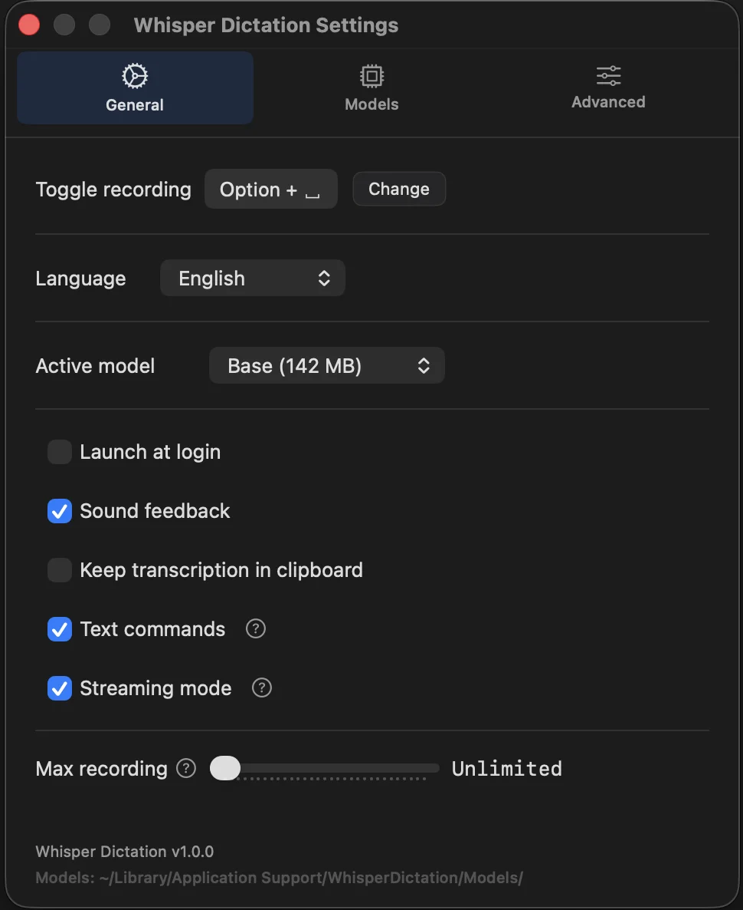
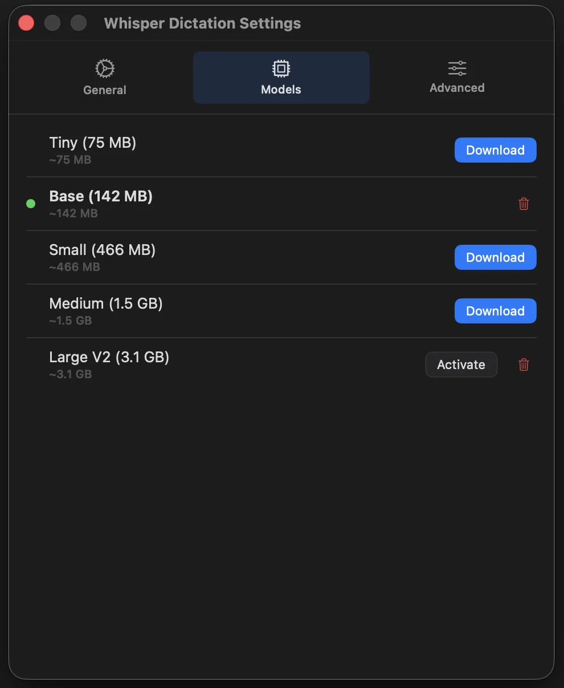
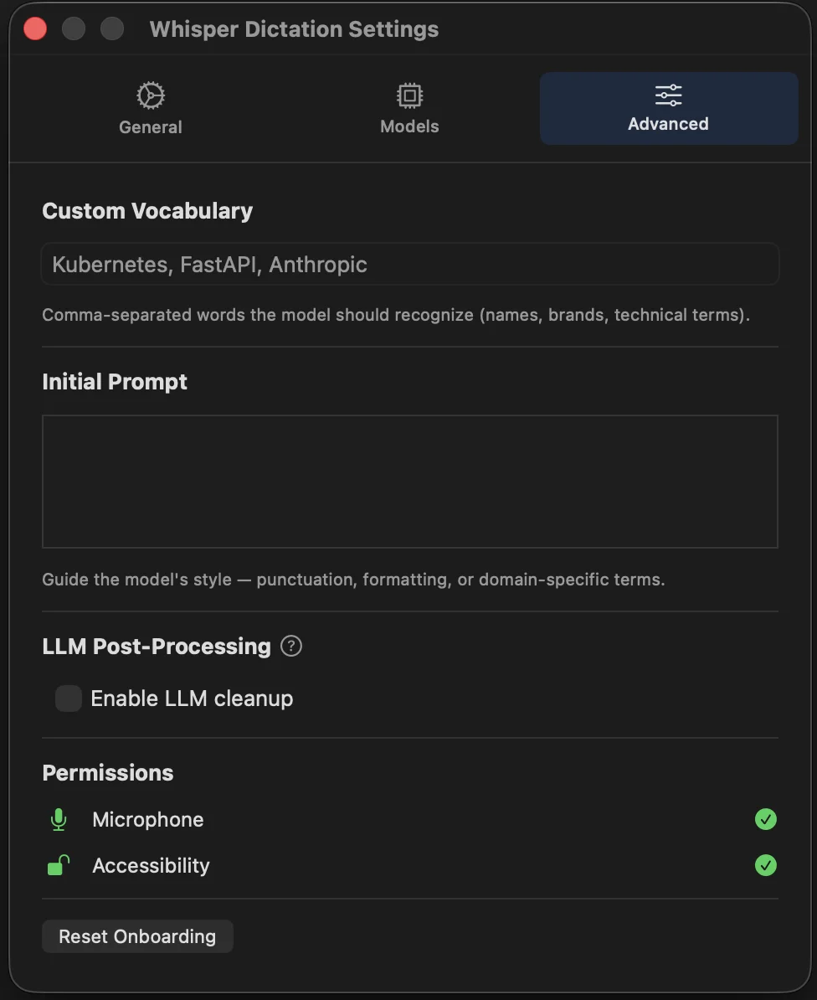

# Whisper Dictation

A macOS menu bar app for voice dictation anywhere on your system. Hold a hotkey, speak, and release to insert text at your cursor. It runs fully offline on your device with local Whisper transcription.

<table>
  <tr>
    <td></td>
    <td></td>
  </tr>
  <tr>
    <td></td>
    <td></td>
  </tr>
</table>

## Install

### Option 1: Download release

1. Download `WhisperDictation-v1.0.0.zip` from [Releases](https://github.com/MichaelEight/desktop-dictate-macos/releases/latest)
2. Unzip and move `WhisperDictation.app` to Applications
3. Right-click the app → **Open** (required on first launch — the app is ad-hoc signed, so Gatekeeper will block a normal double-click)
4. Grant Microphone and Accessibility permissions when prompted

### Option 2: Build from source

```bash
git clone https://github.com/MichaelEight/desktop-dictate-macos.git
cd desktop-dictate-macos
./build.sh
open WhisperDictation.app
```

Requires macOS 14+ and Swift 5.9+ (Xcode Command Line Tools). First build takes 1-3 minutes (compiles whisper.cpp from source).

## Models

Downloaded on-demand from the app. Stored in `~/Library/Application Support/WhisperDictation/Models/`.

| Model    | Size   | Speed   | Accuracy |
| -------- | ------ | ------- | -------- |
| Tiny     | 75 MB  | Fastest | Basic    |
| Base     | 142 MB | Fast    | Good     |
| Small    | 466 MB | Medium  | Better   |
| Medium   | 1.5 GB | Slow    | Great    |
| Large V2 | 3.1 GB | Slowest | Best     |
